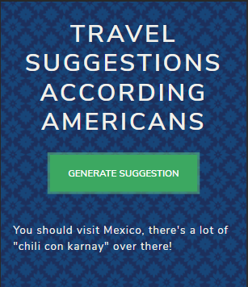
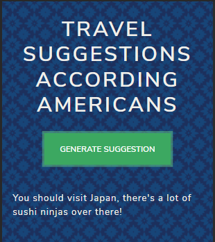

# Travel Suggestions According To Americans - Random Message Generator

> Website that generates a random travel suggestions according to Americans mocking other countries. It combines a random country and a random mocking national stereotype of another country.

## Table of contents

- [General info](#general-info)
- [Screenshots](#screenshots)
- [Technologies](#technologies)
- [Setup](#setup)
- [Features](#features)
- [Status](#status)
- [Inspiration](#inspiration)
- [Contact](#contact)

## General info

Codecademy Mixed Messages Project

## Screenshots




## Technologies

- HTML
- CSS
- Bootswatch Theme (LUX)
- Vanilla Javascript

## Code Examples

Show examples of usage:

```javascript
const generateMessage = () => {
  return `You should visit ${getRandom(
    countries
  )}, there's a lot of ${getRandom(stereotypes)} over there!`
}
```

## Status

Project is: _Completed_

## Inspiration

Project based on... 'THE WORLD ACCORDING TO AMERICANS 2012' from **Yanko Tsvetkov Atlas of Prejudice**. www.alphadesigner.com

## Contact

Created by [@santiagobonilla5](https://github.com/santiagobonilla5) - feel free to contact me!
